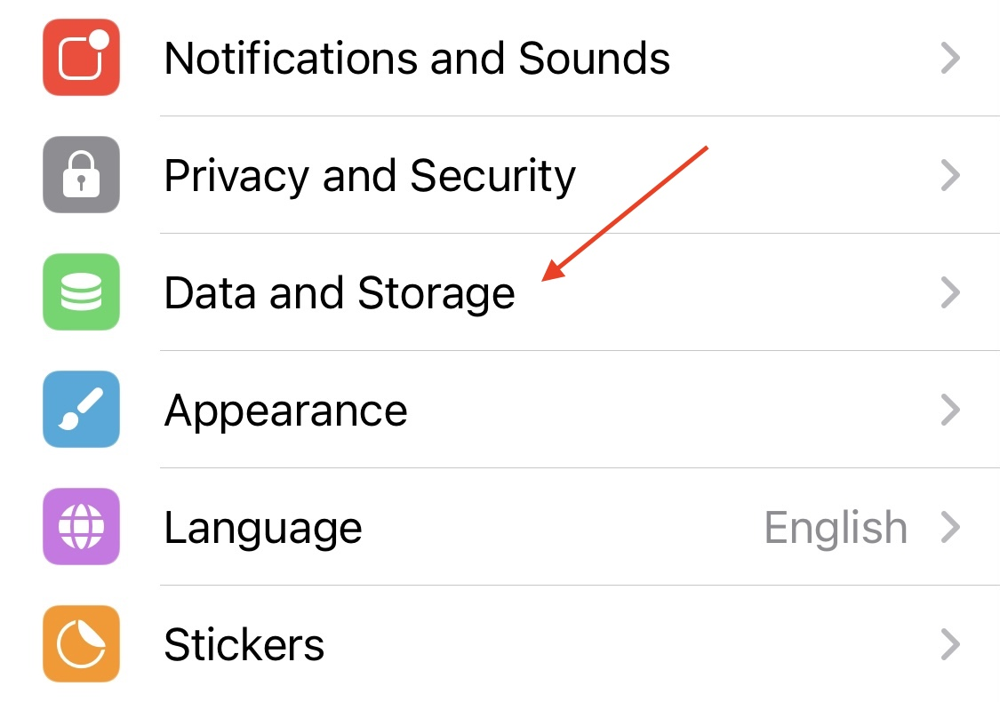
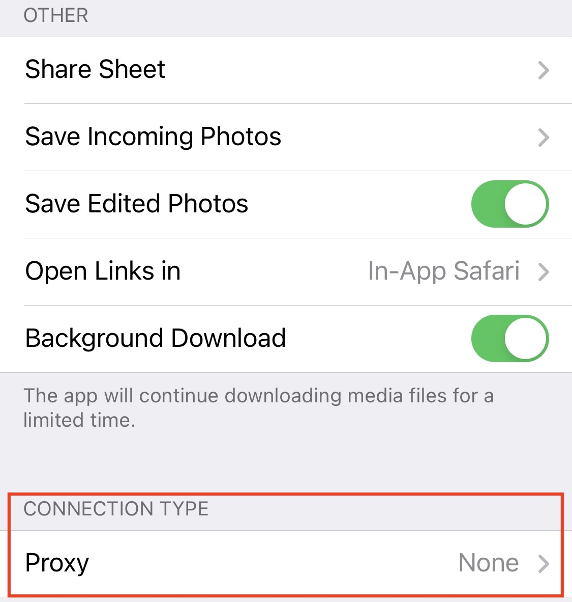
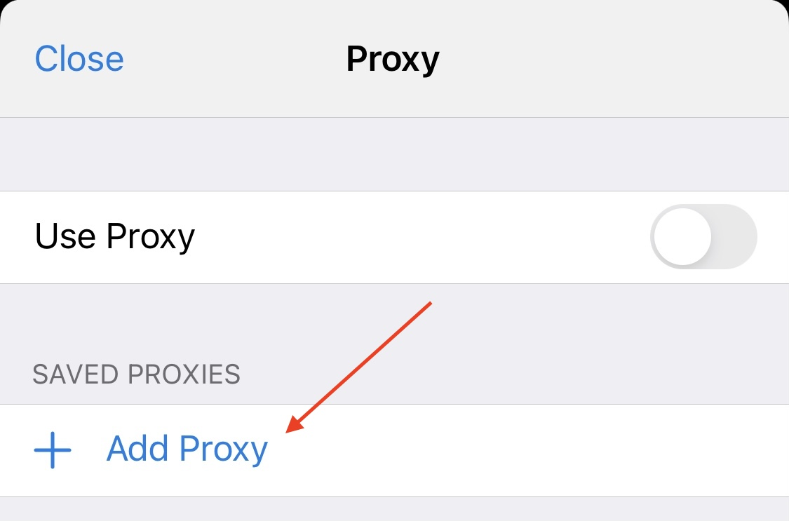
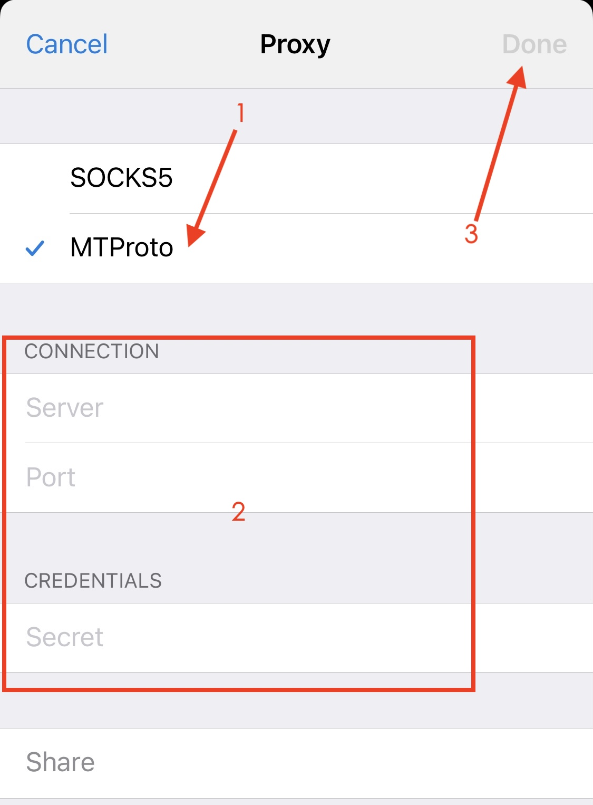
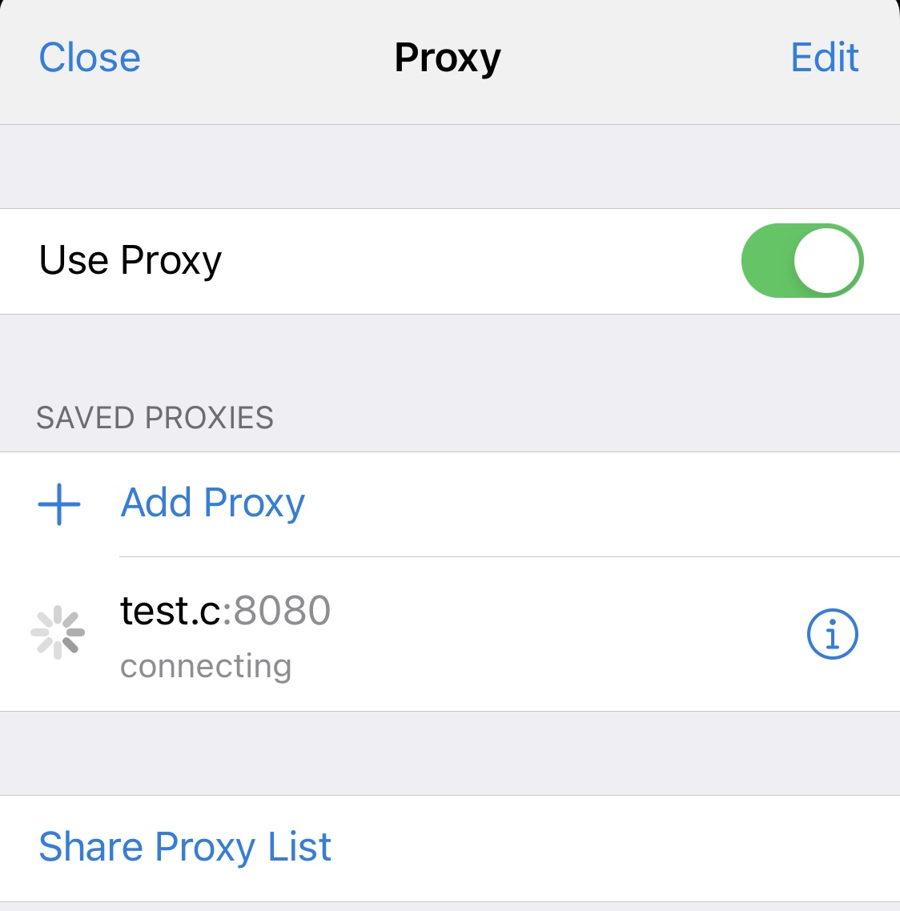
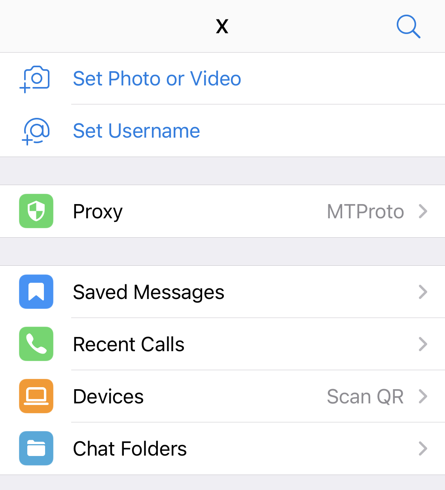

### 文字说明
> 1. 进入我的设置 --> Data and Storage --> CONNECTION TYPE(Proxy) --> + Add Proxy --> 勾选MTProto --> 输入Server、Port、Secret --> Done  
###   
### 图示: 所有设置大同小异
> 1. 进入我的设置，找到Data and Storage(数据和存储) 
  
> 2. 找到CONNECTION TYPE 并点击Proxy 
  
> 3. 进入代理设置界面，点击Add Proxy 
  
> 4. 勾选MTProto, 并填入config.yaml文件中对应的参数，然后点Done 
  
> 5. 配置完成后, 返回到Proxy界面，并打开Use Proxy开关即可 
  
> 6. 切换代理
>> 1. Mac/ios可在<我的设置>选项中Proxy可看到，进去之后可以打开/关闭Proxy，可以切换节点/增加节点 
  
>> 2. android/HarmonyOS可在tg最顶部搜索按钮左边看到一个小盾牌，点进去之后同样可以打开/关闭Proxy，切换节点/增加节点 
  
